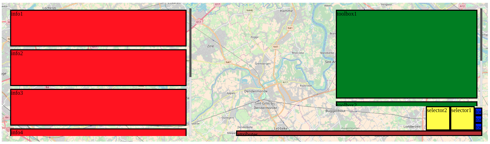

# Gerard

This project is a test to build a map component as a combination of [Openlayers](https://openlayers.org/), [Angular](https://angular.io/) and [Angular Material](https://material.angular.io/).

## Naming

It is named a a tribute to [Gerardus Mercator](https://en.wikipedia.org/wiki/Gerardus_Mercator).


## Goal

I want to make an easy to use component library for maps. The library should be usable in a declarative style (from html tags) and in a programmable style, from typescript.

## Usage

You need to define a map and a map-view. The map contains the definition of the map and the layers, the map-view contains the controls and other gui parts.

### map

You can link a map and a map-view in two ways:

#### Through reference

```html
  <ger-map #map>
    ...
  </ger-map>

  <ger-map-view [mapContainer]="map">
    ...
  </ger-map-view>
```

#### Through containment

```html
  <ger-map>
    <ger-map-view>
      ...
    </ger-map-view>
    ...
  </ger-map>
```

### map-view

A map-view should contain a layout which determines where all parts of the gui end up on the screen.

You can do this by placing a `<ger-layout type="..."></ger-layout>` tag inside the map-view and putting all gui parts inside the layout tag.

The placing of the gui parts is done on the basis of their classnames.

At this moment the following class names are recognised by the two supported layout types:

* view-info: information/tool panel with a small scrollbar. For example: layer selector, search box and result, feature information, ...
* view-toolbox: another information/tool panel with a small scrollbar. For example: layer selector, search box and result, feature information, ...
* view-tools: little buttons that directly interact with the map go here. For example: zoom in, zoom out, zoom to my location, ...
* view-selector: bigger buttons that change the appearance of the map. For example: the background selector, ...
* view-attributes: attributes of the map. For example: scale, copyright, ...

Two layout types exist at the moment: `standard` and `reversed`. But other layouts can be easily made by the user of the library.

#### standard

Here the `view-info` panel is put on the left of the screen and grows to fill the entire height of the map.

The `view-attributes` are put on the right at the bottom, the `view-selector` and `view-tools` above this, with the `view-tools` on the far right, growing up and the `view-selector` left of that growing to the left.

At the right at tha top, the `view-toolbox` panel sits and grows down to fill the rest of the available space on the right.

Here is an example of this:

```html
  <ger-map>
    <ger-map-view>
      <ger-layout type="standard">
        <div class="view-info">info1</div>
        <div class="view-info">info2</div>
        <div class="view-info">info3</div>
        <div class="view-info">info4</div>
        <div class="view-info">info5</div>
        <div class="view-info">info6</div>
        <div class="view-toolbox">toolbox1</div>
        <div class="view-toolbox">toolbox2</div>
        <div class="view-tools">tools1</div>
        <div class="view-tools">tools2</div>
        <div class="view-tools">tools3</div>
        <div class="view-selector">selector1</div>
        <div class="view-selector">selector2</div>
        <div class="view-attributes">attributes</div>
      </ger-layout>
    </ger-map-view>
  </ger-map>
```

This results in this layout:



#### reversed

This is the mirror image of the `standard` layout.

## Angular

This project was generated with [Angular CLI](https://github.com/angular/angular-cli) version 1.7.3.

## Development server

Run `ng serve` for a dev server. Navigate to `http://localhost:4200/`. The app will automatically reload if you change any of the source files.

